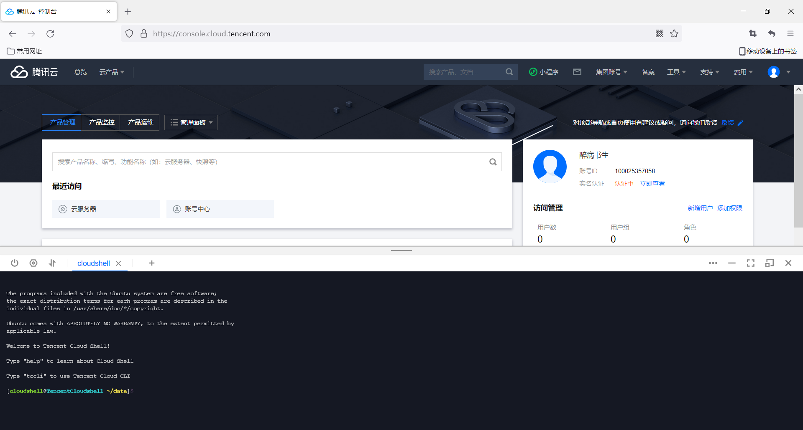

# webshell
基于web的Linux远程访问系统，Linux编程大作业
---
layout: post
title: webshell
slug: webshell
date: 2022-05-24 01:11
status: publish
author: 华仔仔
categories: 
  - Linux
tags: 
  - Linux
  - cloudshell
excerpt: webshell

---

## 写在前面

首先为什么有这篇文章，因为我们一门课程的大作业，有一项是基于web的Linux远程访问系统，在这里我记录了这次大作业的全过程，欢迎大家前来交流。

邮箱：ricardoz_y@qq.com

服务地址：https://mblog.ricardoz.site/webshell/

## 1.webshell的构建

老师讲的是可以通过webssh然后访问浏览器就可以在网页里访问。然后我就想到了之前用的阿里云cloudshell，我可以用iframe将阿里云的cloudshell嵌入我自己的网页，那这样不就可以实现将自己的webshell发布在网上了吗。
然后就发现你用iframe嵌入阿里云的cloudshell就会直接拒绝连接。之后去网上搜了搜，遇到这种情况一般是阿里云在技术层面上封锁了iframe方法。之后我就搜了cloudshell，发现提供cloudshell的不止阿里云一家。谷歌在2015就发布了cloudshell，我们阿里云的友商腾讯云也提供了cloudshell服务。现在去试试腾讯云的cloudshell，好耶，这次没有拒绝连接。而是获取不到cookie，这总比直接拒绝连接来的好。具体遇到的问题会写在最后，下面开始使用腾讯云提供的cloudshell来搭建一个基于web的Linux远程访问系统。

### 1.1 腾讯云cloudshell


点击控制台


点击cloudshell，可以看到如下的cloudshell




我们要做的便是将腾讯云提供的cloudshell嵌入我们自己的web中

[腾讯云cloudshell调用地址](https://iaas.cloud.tencent.com/cloudshell)

使用iframe将这个网址嵌入自己的网页就好啦，不过我看网上说最好不要使用iframe，好像会影响网络安全

这是调用的代码

```html
<iframe id="iframeContent" name="iframeContent" frameborder="0" src="https://iaas.cloud.tencent.com/cloudshell"></iframe>
```

### 1.2 目录系统构建

我一开始的想法是将老师提供给我们实验的指导书转换成html文件，然后使用框架将8个html写到一起，再做一下装饰。但是！这样做不是很丑吗，一是我不怎么会html语言，word自动转成的html让我感觉有点难以接受。二是我前段时间自己搭了一个博客，何不将实验指导书放进我的博客里面。使用统一的category将他们放在一起，还是用Markdown格式书写的，正好最近比较喜欢这个，何乐而不为呢。于是就有了我这个用来装指导书的category.


至于如何搭建的这个博客可以看我的github，我也是fork的别人的

[fork网址](https://github.com/AlanDecode/Blog-With-GitHub-Boilerplate)


## 2.使用iframe框架集成目录系统和cloudssh

关于如何使用iframe来集成2个及以上的网页，我是在csdn上看的一篇博客[网址在这](https://blog.csdn.net/jzy1990/article/details/75806600)，我修改了一下页面布局，让它更加契合实验楼的风格。下面看看效果。


这里已经将webshell部署在了github上，使用github pages静态托管，可以通过在浏览器输入https://mblog.ricardoz.site/webshell/来访问，做到这里可以看到大作业到此算是完成了大部分，但是凡是都不是完美的，下面就来说说问题吧。


## 3.关于一些问题

本次大作业实现的过程中遇到的问题，下面就统一说下，问题还是比较多的，尤其是不兼容的问题感觉会对本次大作业的评分造成很大的影响。

**1)无法解决跨域问题**

不能说无法解决，应该说我解决不了，通过和老师讨论，老师让我使用js强制写入cookie，我在网上搜了好多如何写js，用js的帖子，找到了不少有很多我看不懂的，其中一篇我觉得写的是我能看懂的，[网址在这](https://juejin.cn/post/6844904099612196877)

里面写道有两种方法：1.使用Javascript API将以前通过`document.cookie=xxx`的方式，修改为我们自定义的`setCookie`方法来处理就可以了

```javascript
function setCookie(cookieString, canCrossSite) {
    document.cookie = `${cookieString}`;
    if(canCrossSite) {
        document.cookie = `${cookieString}; SameSite=None; Secure`;
    }
}
```

2.通过请求头中携带`Set-Cookie`的头信息，可以完成后端请求给浏览器设置`cookie`，设置以后对于需要跨站请求的`cookie`就符合我们的预期，例如：

```javascript
const http = require('http');
http.createServer((req, res) => {
    res.setHeader('Set-Cookie', ['key5=page2; SameSite=None; Secure', 'key6=page2']);
    res.setHeader('Access-Control-Allow-Origin', '*');
    res.end('end');
}).listen(3001);
```

访问`http://localhost:3001/index`以后可以发现，请求`cookie`携带`key6=page2`

```javascript
const http = require('http');
const fs = require('fs');
const server = http.createServer;
const options = {
    key: fs.readFileSync('./key.pem'),
    cert: fs.readFileSync('./cert.pem')
};
server(options, (req, res) => {
    console.log(req.url)
    if(req.url.indexOf('/index') > -1) {
        res.setHeader('Access-Control-Allow-Origin', '*');
        res.end('index');
    } else {
        res.setHeader('Set-Cookie', ['key5=abc; SameSite=None; Secure;', 'key6=def;']);
        res.setHeader('Access-Control-Allow-Origin', '*');
        res.end('end');
    }
}).listen(3001);

```

访问`https://localhost:3001/index`以后可以发现，请求`cookie`携带`key5=page2`和`key6=page2`

然后我的本次大作业是没有后端的，我只写了一个index.html文件，所以是不可能通过后端来修改的，只能通过前端来修改(也不是不可以写一个后端程序，在我的印象里用Django，flask，springboot都是可以的)，然后我就在我的代码里设置了这个js


可能是我设置的有问题，但是我是真的不会写前端的东西，所以这个设置了还是和没设置一样，一打开就成了这个老样子


这句Missing cookie parameters我是真的看烦了，整了它一个星期还是没搞定。


**2)一些产商无法使用iframe嵌入的问题**

阿里云的cloudshell使用iframe的时候就会出现xxx拒绝连接，网址：https://shell.aliyun.com/，尝试代码如下

```
<iframe id="iframe" name="iframe" width="100%" height="100%" frameborder="0" src="https://shell.aliyun.com/" style="height:900px; width:100%;"></iframe>
```

使用腾讯云的cloudshell，在iframe嵌入时就会遇到上面所说的Missing cookie parameters问题。


**3)iframe布局不知道如何写**

写iframe的时候，一开始只有想法，还不知道如何去实现，最后是参考了一遍博客，参考了人家写的框架，[参考链接](https://blog.csdn.net/jzy1990/article/details/75806600)

```
<!DOCTYPE html>
<html xmlns=" ">
 
<head>
    <meta charset="utf-8" />
    <meta name="viewport" content="width=device-width, initial-scale=1.0" />
    <title>Home</title>
    <style>
        #iframeTop{
            width: 100%;
            height: 70px;
        }
        #iframeLeft{
            width: 15%;
            height: 700px;
            float: left;
        }
        #iframeContent{
            width: 84%;
            height: 700px;
        }
    </style>
<body>
<div>
    <iframe id="iframeTop" name="iframeTop" frameborder="0" src="view/top.html"></iframe>
    <iframe id="iframeLeft" name="iframeLeft" frameborder="0" src="view/left.html"></iframe>
    <iframe id="iframeContent" name="iframeContent" frameborder="0" src="view/content.html"></iframe>
</div>
</body>
</html>
```

 

## 4.如何解决

1）Chrome浏览器80-94可以通过设置禁用samesite属性

Chrome浏览器打开新选项卡，并在地址栏中分别输入

chrome ://flags//same-site-by-default-cookies

chrome ://flags//# cookies-without-same-site-must-be-secure

将这两项都设置成disable就可以啦

2）Chrome94以上设置了samesite属性默认打开，开发者无法手动设置none，所以Chrome94以上的浏览器是用不了了

3）Chrome80以下的应该是无需设置

4）使用火狐浏览器可以直接打开，无需设置


比较chrome和firefox的请求标头和响应标头：

firefox :在首次启动请求后，服务端返回会话id，然后为请求中的每个cookie带来会话id。

chrome :由于请求标头始终没有sessionId，且整个cookie为空，因此服务每次都无法接受sessionId，每次都重新分配session。


**还有一些关于cookie，session，token之间有什么关系和区别的知识**

1）cookie数据存放在客户的浏览器上，session数据放在服务器上。

2）cookie不是很安全，别人可以分析存放在本地的cookie并进行cookie欺骗，考虑到安全应当使用session。

3）session会在一定时间内保存在服务器上，存储在服务器的数据会更加的安全，不容易被窃取。当访问增多，会比较占用你服务器的性能与资源，应当使用cookie。

4）单个cookie保存的数据不能超过4K，很多浏览器都限制一个站点最多保存20个cookie。因此使用cookie只能存储一些小量的数据。

5）session和session_id：服务器会保存一份，可能保存到缓存/数据库/文件，session_id一般是随机字符串，要到服务器检索id的有效性。Session通过cookie存储session_id，然后具体的数据则是保存在session中。如果用户已经登录，则服务器会在cookie中保存一个session_id，下次再次请求的时候，会把该session_id携带上来，服务器根据session_id在session库中获取用户的session数据。

6）token：服务器不需要记录任何东西，每次都是一个无状态的请求，每次都是通过解密来验证是否合法。


## 5.快速使用

1）使用火狐浏览器或谷歌80以下打开[腾讯云·控制台](https://console.cloud.tencent.com/), 点击右上角工具，cloudshell。

2）打开[我的webshell](https://mblog.ricardoz.site/webshell/), 左边即为Linux编程实验指导书，右边为腾讯云提供的cloudshell。


## 6.个人感悟

在做大作业的时候，越做越到后面，越会忍不住的想，为什么要做这个基于web的Linux远程访问系统。是不想搭建Linux系统吗，显然不是的，一个工科学生谁会没有自己的Linux系统。是想做实验时方便点吗，显然我们使用分屏更简单呀。左边一个word，右边虚拟机这样用起来不是更方便吗？

这些想法在我看了一些提供学习的平台地方得到答案。我们做的这个基于web的Linux远程访问系统，不应该止步于此呀。为什么要将眼光局限于只能用来做Linux实验呢，我可以多做几个目录呀，学习算法，学习编程，学习c。当你忘了一些Linux操作的时候，打开webshell随手就能打起来了呀。甚至在高铁上想敲代码，走路的时候有好点子想试试呢。这不是很方便吗？

思止于此，内心对于做了一个几乎没有兼容性的，网页布局很差的webshell有了一些安慰。毕竟第一次做这个东西，很多东西都不是很了解，今后对于这个项目会定期维护的。后期将会加一些别的东西进去。

